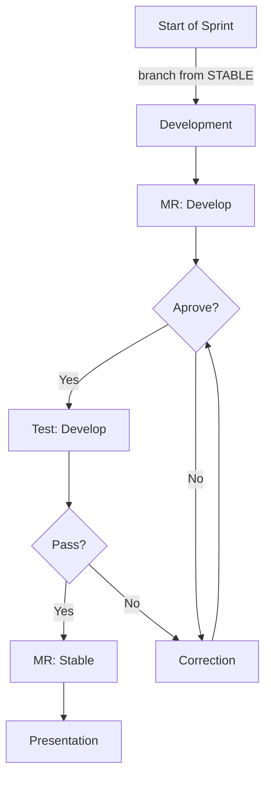

## How to Run 

### **Informações Necessárias**
- Versão do Node do projeto é a 16.17.0
- Manager Package é o [Yarn](https://classic.yarnpkg.com/en/)

**In terminal**

- ```git clone https://github.com/efrainmpp1/BaseProject-ReactJS.git```
- ```cd BaseProject-ReactJS```
- ```yarn```
- ```yarn start```

## **Fluxo de Desenvolvimento**

**Sprint**
